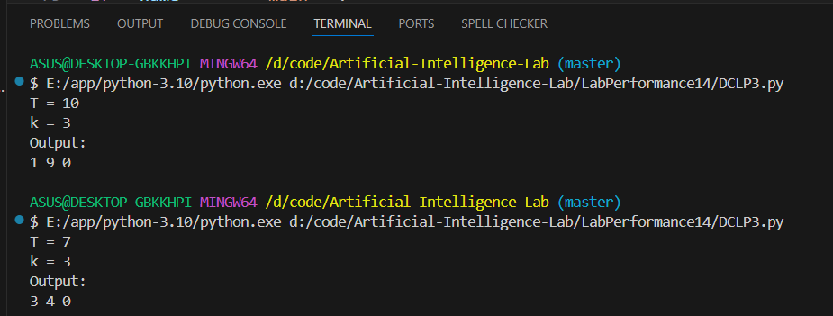

# Genetic Algorithm:
This project implements a simple **Genetic Algorithm (GA)** to solve a numeric optimization problem. The objective is to find two numbers (from 0 to 9) whose sum is as close as possible to a target value `T`.

## 🔍 Problem Statement
Given:
- A target number `T`
- A number of genes `k` (only the first two are used for the sum)
- Each gene is an integer from 0 to 9
- K-Difference 
- Cross over / mutilation

The algorithm tries to evolve a population of candidate solutions until the sum of the first two genes in an individual equals `T`, or until a maximum number of generations is reached.

## 🧬 Fitness Function
The fitness of an individual is calculated as:
 ## abs (T-(L[0] + L[1] ))

 # Output:
 

